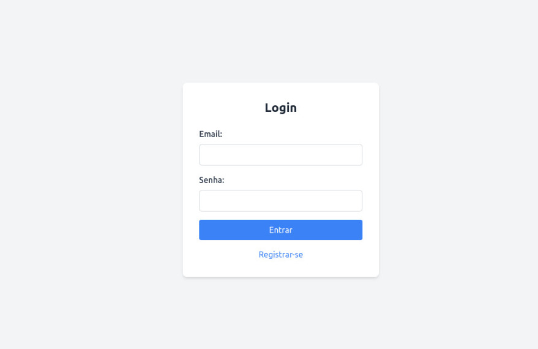

# 🎞️ Sistema de Locadora VHS

O sistema tem como objetivo permitir o gerenciamento de uma coleção de fitas VHS, com funcionalidades de login para o usuário e cadastro, edição, exclusão, listagem e controle de status das fitas VHS.

---

## Como utilizar a aplicação

1. Clone o projeto:

``git clone git@github.com:juliaazeved0/controle-locadora-vhs.git``

2. Abra o projeto em sua IDE de preferência.

3. Configure o arquivo application.properties com seu banco de dados MySQL (usuário e senha):
   
``
spring.datasource.username=seu_usuario
spring.datasource.password=sua_senha
``

5. Inicie a aplicação com o Spring Initializer.

6. Acesse no navegador: http://localhost:8080/login

7. Cadastre um usuário e comece a usufruir dos recursos e funcionalidades da aplicação.

---
# Tecnologias utilizadas

- Linguagem Java 21
- Spring Boot Framework
- MySQL Server
- HTML
- Tailwind CSS (via CDN)

# Dependências do projeto

- Spring Web 
- Thymeleaf 
- Spring Data JPA (ORM)
- MySQL Driver
- Lombok 
- Spring Boot DevTools

---
# Funcionalidades da aplicação

- Cadastro, edição e exclusão de fitas VHS (CRUD)
- Controle de status das fitas com Enum: DISPONIVEL, EMPRESTADA e  INDISPONIVEL
- Listagem de fitas com os seguintes dados: ID, Título, Imagem (opcional), Diretor, Categoria, Data de cadastro e Status.

---
# Interface 

A interface foi construída com Thymeleaf e estilizada com Tailwind CSS via CDN, oferecendo layout moderno e responsivo.

---
# Desenvolvimento

Esta aplicação foi desenvolvida em conjunto por **@juliazeved0** e **@melissazanoni** como projeto semestral da disciplina de Desenvolvimento Web III, no curso de Análise e Desenvolvimento de Sistemas do IFPR.

GitHub: @juliaazeved0
GitHub: @melissazanoni
